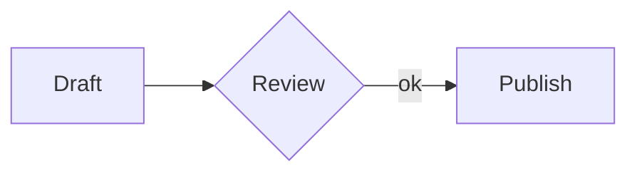

# Sample post for the editor round trip

This paragraph has **bold**, *italic*, ~~struck~~, `inline code`, a [link](https://example.com "Example"), ==highlighted text==, {+added words+} and {-removed words-}.

## Lists

- First item
- Second item with **bold**
  - Nested item

1. One
2. Two

- [x] Done task
- [ ] Open task

## Quote and callout

> A plain quote with *emphasis*.

> [!WARNING]
> Mind the **gap**.

## Code

```js
const answer = 42;
console.log(`answer ${answer}`);
```



## Math

Inline math $E = mc^2$ sits in a sentence, prices like $5 stay text.

$$
\int_0^1 x^2 \, dx = \frac{1}{3}
$$

## Table

| Task | Owner | Hours |
| --- | --- | --- |
| Write | Daniel | 2 |
| Review | Daniel | 1 |

## Image


---

A claim with a footnote.[^1]

[^1]: The source of the claim.
